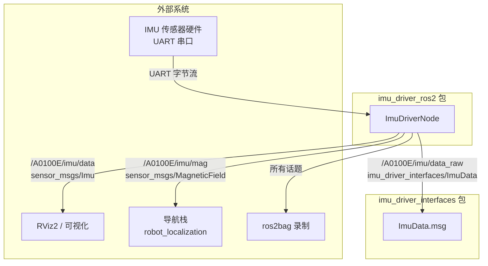
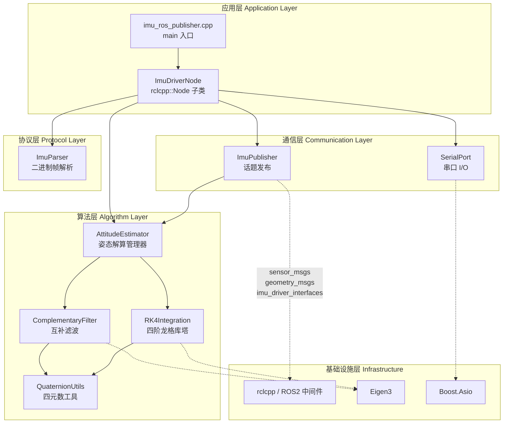
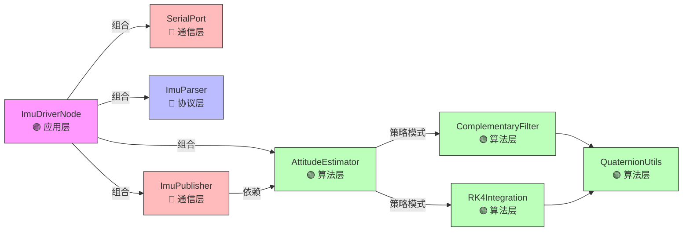
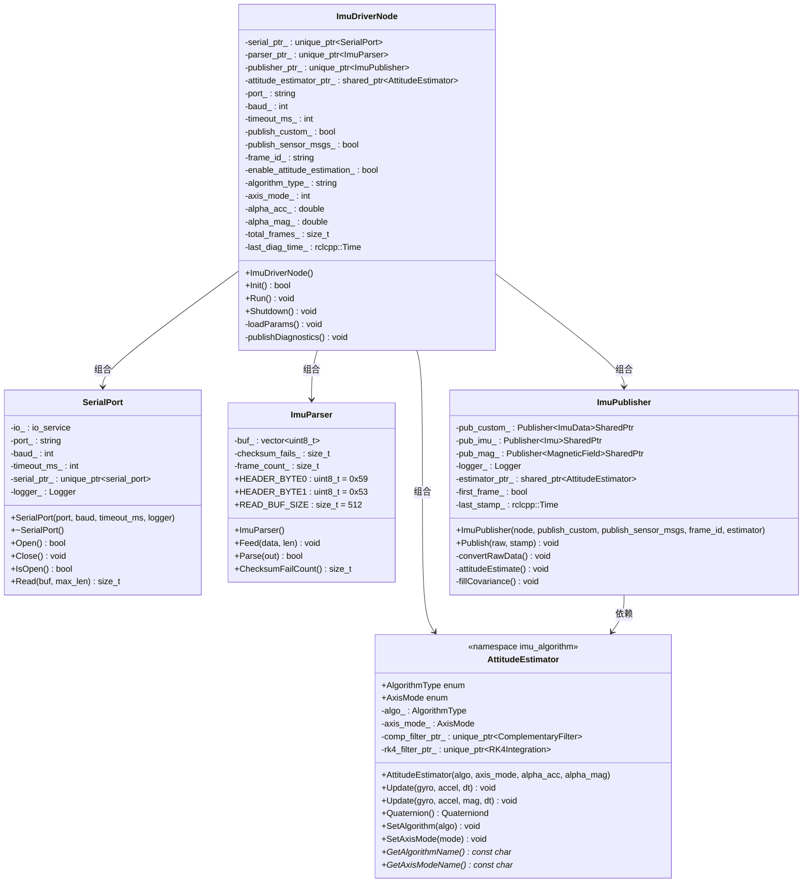
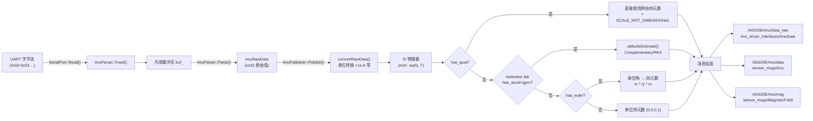
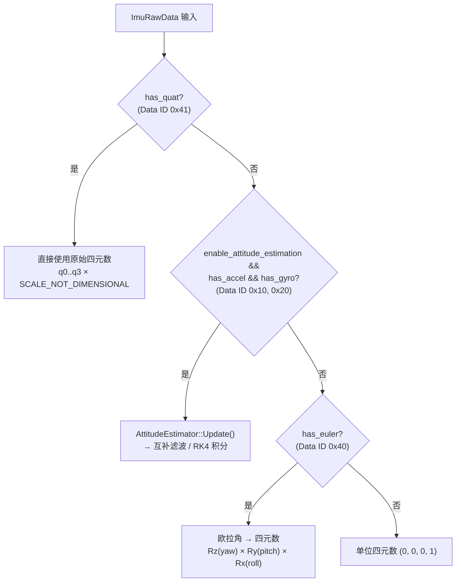
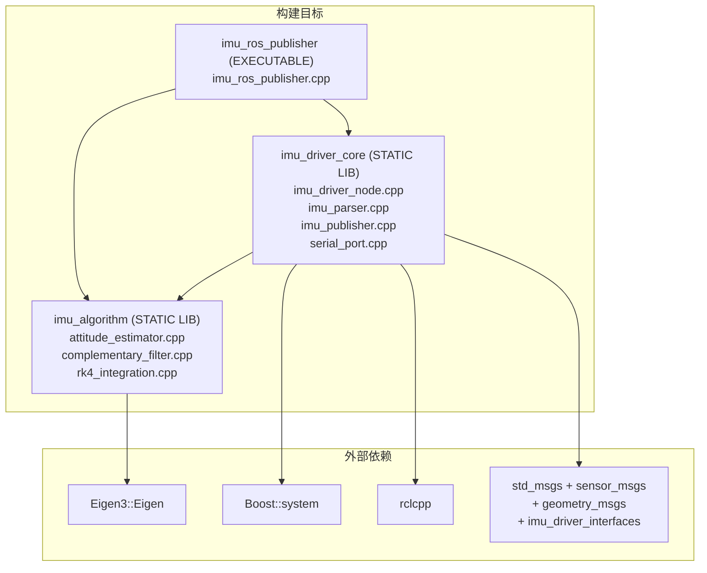
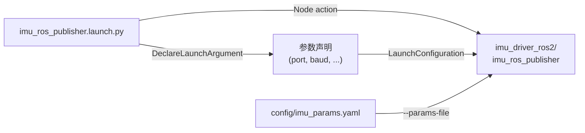

# IMU Driver ROS2 架构设计文档

## 1. 文档元信息

| 字段 | 值 |
|------|-----|
| 文档名称 | IMU Driver ROS2 架构设计文档 |
| 版本 | v1.0 |
| 作者 | guofeng |
| 状态 | Draft |
| 创建日期 | 2026-06-09 |
| ROS2 发行版 | Humble |
| C++ 标准 | C++17 |

### 变更记录

| 版本 | 日期 | 修改人 | 修改内容 |
|------|------|--------|---------|
| v0.1 | — | guofeng | 初始 ROS1→ROS2 迁移计划 |
| v1.0 | 2026-06-09 | guofeng | 升级为架构设计文档，补充系统上下文、分层视图、接口契约、数据设计、风险与验收 |

---

## 2. 项目概述

### 2.1 目标

将 ROS1 `imu_driver_ros` 迁移为 ROS2 `imu_driver_ros2`，实现串口 IMU 数据采集、二进制协议解析、姿态解算与标准化消息发布。

### 2.2 范围

**在范围内：**

- 节点生命周期管理（Init / Run / Shutdown）
- 串口通信（Boost.Asio 同步读取 + 超时）
- 二进制协议帧解析（帧头搜索、校验和验证、Data ID 分发）
- 姿态解算（互补滤波 / RK4 四阶龙格库塔，6 轴 / 9 轴）
- 标准消息发布（`sensor_msgs/Imu`、`sensor_msgs/MagneticField`）
- 自定义消息发布（`imu_driver_interfaces/ImuData`）
- ROS2 参数声明与加载
- Python Launch 部署
- YAML 参数配置文件

**不在范围内：**

- 传感器硬件驱动固件修改
- 多传感器融合
- SLAM / 导航栈集成

### 2.3 成功标准

| 指标 | 目标值 |
|------|--------|
| 串口数据校验通过率 | > 99.9% |
| 姿态解算输出频率 | ≥ 100 Hz |
| 端到端延迟（串口读取 → 消息发布） | < 10 ms |
| ROS2 linter | 零警告通过 |
| `colcon build` | 零错误零警告 |

---

## 3. 系统上下文

### 3.1 系统上下文图



### 3.2 外部依赖

| 依赖 | 版本要求 | 用途 | 来源 |
|------|---------|------|------|
| `rclcpp` | Humble+ | ROS2 C++ 客户端库 | ros2 |
| `imu_driver_interfaces` | 同工作空间 | 自定义 `ImuData.msg` 消息包 | 工作空间内 |
| `std_msgs` | Humble+ | `Header` 等基础消息 | ros2 |
| `sensor_msgs` | Humble+ | `Imu`, `MagneticField` 标准消息 | ros2 |
| `geometry_msgs` | Humble+ | `Vector3`, `Quaternion` | ros2 |
| `Eigen3` | 3.3+ | 姿态解算线性代数 | 系统包 |
| `Boost` | 1.65+ | `asio` 串口通信 / `system` 错误码 | 系统包 |

> **关键架构决策**：自定义消息 `ImuData.msg` 已拆分为独立接口包 `imu_driver_interfaces`（参见 [`CMakeLists.txt:19`](../CMakeLists.txt#L19)），而非包内 `msg/` + `rosidl_generate_interfaces` 方案。理由：避免循环依赖，支持跨包复用，符合 ROS2 推荐实践。

---

## 4. 架构视图

### 4.1 分层架构视图



**分层原则：**

| 层级 | ROS 依赖 | 可独立测试 | 说明 |
|------|---------|-----------|------|
| 应用层 | ✅ 依赖 `rclcpp::Node` 继承 | 需 ROS2 环境 | 唯一继承 Node 的层 |
| 通信层 | ✅ 依赖 `rclcpp::Node*` / `rclcpp::Logger` | 需 ROS2 环境 | 通过指针注入，不继承 Node |
| 协议层 | ❌ 纯 C++ | ✅ 可独立 Google Test | 零 ROS 依赖 |
| 算法层 | ❌ 纯 C++/Eigen | ✅ 可独立 Google Test | 零 ROS 依赖 |

### 4.2 组件依赖图



### 4.3 类图



### 4.4 数据流视图



---

## 5. 接口设计

### 5.1 话题接口

| 话题名 | 消息类型 | 发布条件 | QoS 策略 |
|--------|---------|---------|---------|
| `/A0100E/imu/data_raw` | `imu_driver_interfaces::msg::ImuData` | `publish_custom == true` | 默认（Reliable + Volatile） |
| `/A0100E/imu/data` | `sensor_msgs::msg::Imu` | `publish_sensor_msgs == true` | 默认（Reliable + Volatile） |
| `/A0100E/imu/mag` | `sensor_msgs::msg::MagneticField` | `publish_sensor_msgs == true` | 默认（Reliable + Volatile） |

> **改进项**：话题名当前硬编码在 [`imu_publisher.cpp`](../src/imu_publisher.cpp) 中，多 IMU 部署时将产生命名冲突。建议参数化话题命名空间前缀（如 `declare_parameter("topic_prefix", "A0100E")`）。
>
> **改进项**：IMU 传感器数据推荐使用 `SensorDataQoS`（BestEffort + Volatile），可降低网络开销和延迟。

### 5.2 参数接口

| 参数名 | 类型 | 代码默认值 | YAML 默认值 | 说明 |
|--------|------|-----------|------------|------|
| `port` | string | `/dev/ttyACM0` | `/dev/ttyACM0` | 串口设备路径 |
| `baud` | int | 115200 | 115200 | 波特率 |
| `timeout_ms` | int | 100 | 100 | 串口读取超时（毫秒） |
| `publish_custom` | bool | **true** | **false** | 是否发布自定义 ImuData |
| `publish_sensor_msgs` | bool | false | true | 是否发布标准 sensor_msgs |
| `frame_id` | string | `imu_link` | `imu_link` | 坐标系 ID |
| `enable_attitude_estimation` | bool | true | true | 是否启用姿态解算 |
| `algorithm_type` | string | `complementary` | `complementary` | 算法类型 |
| `axis_mode` | int | `9` | `9` | 轴数模式 |
| `alpha_acc` | double | 0.02 | 0.02 | 加速度计融合系数 |
| `alpha_mag` | double | 0.01 | 0.01 | 磁力计融合系数 |

> ⚠️ **不一致**：`publish_custom` 和 `publish_sensor_msgs` 在代码（[`imu_driver_node.cpp:15-16`](../src/imu_driver_node.cpp#L15)）与 YAML（[`imu_params.yaml:13-14`](../config/imu_params.yaml#L13)）中默认值相反。建议统一为 YAML 中的值（`publish_custom: false`, `publish_sensor_msgs: true`），YAML 作为唯一真源。

### 5.3 组件间接口

#### ImuDriverNode → SerialPort

```cpp
// 构造时注入 Logger
SerialPort(const std::string& port, int baud, int timeout_ms = 100,
           const rclcpp::Logger& logger = rclcpp::get_logger("serial_port"));
bool Open();
void Close();
bool IsOpen() const;
size_t Read(uint8_t* buf, size_t max_len);
```

#### ImuDriverNode → ImuParser

```cpp
ImuParser();
void Feed(const uint8_t* data, size_t len);
bool Parse(ImuRawData& out);
size_t ChecksumFailCount() const;
```

#### ImuDriverNode → ImuPublisher

```cpp
// 通过 rclcpp::Node* 指针创建 Publisher
ImuPublisher(rclcpp::Node* node, bool publish_custom, bool publish_sensor_msgs,
             const std::string& frame_id,
             std::shared_ptr<imu_algorithm::AttitudeEstimator> estimator);
void Publish(const ImuRawData& raw, const rclcpp::Time& stamp);
```

#### ImuPublisher → AttitudeEstimator

```cpp
// 策略模式：运行时根据 axis_mode 选择 6 轴 / 9 轴接口
void Update(const Eigen::Vector3d& gyro, const Eigen::Vector3d& accel, double dt);
void Update(const Eigen::Vector3d& gyro, const Eigen::Vector3d& accel,
            const Eigen::Vector3d& mag, double dt);
const Eigen::Quaterniond& Quaternion() const;
```

---

## 6. 数据设计

### 6.1 原始数据 → 物理量缩放映射

| Data ID | 字段 | 原始类型 | 缩放因子 | SI 单位 |
|---------|------|---------|---------|---------|
| `0x10` | ax, ay, az | int32 | × 1e-6 | m/s² |
| `0x20` | wx, wy, wz | int32 | × 1e-6 × π/180 | rad/s |
| `0x30` | hx, hy, hz | int32 | × 1e-6 | 无量纲（归一化） |
| `0x31` | mx, my, mz | int32 | × 0.001 × 1e-4 | T |
| `0x40` | pitch, roll, yaw | int32 | × 1e-6 × π/180 | rad |
| `0x41` | q0, q1, q2, q3 | int32 | × 1e-6 | 无量纲 |
| `0x01` | temp | int16 | × 0.01 | °C |

### 6.2 姿态四元数优先级策略



### 6.3 ImuRawData → ROS 消息字段映射

| `ImuRawData` 字段 | `imu_driver_interfaces::msg::ImuData` 字段 | `sensor_msgs::msg::Imu` 字段 | 转换逻辑 |
|-------------------|---------------------------------------------|------------------------------|---------|
| ax, ay, az | `linear_acceleration` | `linear_acceleration` | × `SCALE_ACCEL` → `geometry_msgs::msg::Vector3` |
| wx, wy, wz | `angular_velocity` | `angular_velocity` | × `SCALE_GYRO` × `Deg2Rad` → `geometry_msgs::msg::Vector3` |
| mx, my, mz / hx, hy, hz | `magnetic_field` | — | 优先 0x31 强度，否则 0x30 归一化 → `geometry_msgs::msg::Vector3` |
| — | — | `magnetic_field` (MagneticField 话题) | 同上 |
| q0..q3 / estimated / euler | `orientation` | `orientation` | 优先级策略见 §6.2 → `geometry_msgs::msg::Quaternion` |
| valid | `valid` | — | 直接映射 |

### 6.4 协方差矩阵策略

| 消息字段 | 未知姿态 | 已知姿态 |
|---------|---------|---------|
| `orientation_covariance[0]` | -1.0 | 0.0 |
| `orientation_covariance[1..8]` | 0.0 | 0.0 |
| `linear_acceleration_covariance` | 全 0.0 | 全 0.0 |
| `angular_velocity_covariance` | 全 0.0 | 全 0.0 |
| `magnetic_field_covariance` | 全 0.0 | 全 0.0 |

> **改进项**：当前协方差矩阵全置零，未提供实际不确定性估计。建议后续根据传感器规格书填入标称方差值。

---

## 7. 部署设计

### 7.1 构建目标关系



### 7.2 构建配置要点

| 配置项 | 值 | 说明 |
|--------|-----|------|
| C++ 标准 | 17 | ROS2 Humble+ 推荐 |
| 编译警告 | `-Wall -Wextra -Wpedantic` | GCC/Clang 均启用 |
| 算法库 | `STATIC` | 无 ROS 依赖，可独立链接 |
| 核心库 | `STATIC` | 包含 ROS2 依赖的源文件 |
| 测试框架 | `ament_lint_auto` | 当前仅静态检查 |

### 7.3 Launch 部署模型



**启动方式**：

```bash
# 方式 1：ros2 run + 参数文件
ros2 run imu_driver_ros2 imu_ros_publisher --ros-args --params-file config/imu_params.yaml

# 方式 2：launch 文件（推荐）
ros2 launch imu_driver_ros2 imu_ros_publisher.launch.py port:=/dev/ttyACM0 baud:=115200

# 方式 3：launch 文件 + 参数文件
ros2 launch imu_driver_ros2 imu_ros_publisher.launch.py --params-file config/imu_params.yaml
```

---

## 8. 架构决策记录（ADR）

### ADR-001：自定义消息独立为 `imu_driver_interfaces` 包

| 项目 | 内容 |
|------|------|
| **状态** | ✅ 已采纳 |
| **背景** | ROS1 原版在包内定义 `ImuData.msg`，ROS2 需决定消息定义位置 |
| **决策** | 将 `ImuData.msg` 拆分为独立接口包 `imu_driver_interfaces` |
| **备选方案** | 包内 `msg/` + `rosidl_generate_interfaces` |
| **理由** | 避免循环依赖（包内目标依赖自身生成的消息头文件），支持跨包复用，符合 ROS2 推荐实践 |
| **影响** | 工作空间中须先编译 `imu_driver_interfaces`，再编译 `imu_driver_ros2` |

### ADR-002：ImuPublisher 通过 `rclcpp::Node*` 组合

| 项目 | 内容 |
|------|------|
| **状态** | ✅ 已采纳 |
| **背景** | `ImuPublisher` 需要 `create_publisher` 能力 |
| **决策** | 构造函数接收 `rclcpp::Node*` 指针，通过指针创建 Publisher |
| **备选方案** | `ImuPublisher` 继承 `rclcpp::Node`（多节点） |
| **理由** | 单一职责，避免多节点拓扑复杂性；ROS2 单进程多节点增加调试难度 |

### ADR-003：SerialPort 通过构造函数注入 `rclcpp::Logger`

| 项目 | 内容 |
|------|------|
| **状态** | ✅ 已采纳 |
| **背景** | `SerialPort` 需要日志输出能力，但不继承 Node |
| **决策** | 构造函数接收 `rclcpp::Logger` 引用，默认值为 `rclcpp::get_logger("serial_port")` |
| **备选方案** | 使用 `RCLCPP_INFO_NAMED("serial_port", ...)` 全局命名宏 |
| **理由** | 可控的日志上下文，日志名与节点名关联；避免全局状态依赖；便于单元测试时注入 mock logger |

### ADR-004：主循环使用 `rclcpp::ok()` + `spin_some()`

| 项目 | 内容 |
|------|------|
| **状态** | ✅ 已采纳 |
| **背景** | IMU 串口读取是阻塞 I/O，需要与 ROS2 回调处理共存 |
| **决策** | `while(rclcpp::ok())` 循环 + `rclcpp::spin_some(shared_from_this())` |
| **备选方案** | Timer 回调模式 |
| **理由** | Timer 回调无法保证串口读取的实时性和连续性；阻塞读取在主线程更可控 |

### ADR-005：姿态解算策略模式（运行时切换）

| 项目 | 内容 |
|------|------|
| **状态** | ✅ 已采纳 |
| **背景** | 需要支持互补滤波和 RK4 两种算法，且可通过 ROS2 参数切换 |
| **决策** | `AttitudeEstimator` 内部持有 `ComplementaryFilter` / `RK4Integration` 的 `unique_ptr`，运行时根据 `AlgorithmType` 分发 |
| **备选方案** | 编译期模板策略 |
| **理由** | ROS2 参数动态重配需要运行时切换能力；模板策略会导致编译单元膨胀 |

---

## 9. 质量属性

| 属性 | 设计措施 | 验证方式 |
|------|---------|---------|
| **可测试性** | 算法层 / 协议层零 ROS 依赖，可独立 Google Test | `ament_add_gtest` 单元测试 |
| **可配置性** | 所有运行参数通过 `declare_parameter` 声明 | `ros2 param list / dump` 验证 |
| **可观测性** | Logger 注入 + 60s 诊断日志 + checksum 计数 | 日志输出验证 |
| **实时性** | 阻塞串口读取 + `spin_some()` 不阻塞主循环 | 延迟测量 |
| **可维护性** | 分层架构 + 策略模式 + 接口隔离 | 代码审查 |
| **可移植性** | C++17 标准，无平台特定 API | 跨平台编译验证 |

---

## 10. 风险与缓解

| 编号 | 风险 | 概率 | 影响 | 缓解措施 |
|------|------|------|------|---------|
| R-001 | 串口超时导致 `spin_some()` 饥饿 | 中 | 高 | `timeout_ms` 下限 100ms；考虑异步串口 + Timer 架构演进 |
| R-002 | 默认参数不一致（yaml vs 代码） | 高 | 低 | 统一默认值，YAML 作为唯一真源 |
| R-003 | 话题名硬编码，多 IMU 部署冲突 | 中 | 中 | 参数化话题命名空间前缀 |
| R-004 | `imu_driver_interfaces` 包不存在导致编译失败 | 低 | 高 | CI 中确保工作空间完整；`CMakeLists.txt` 中 `REQUIRED` 标志提前报错 |
| R-005 | `Boost.Asio io_service` 已弃用 | 低 | 低 | 后续迁移至 `io_context`（C++14+ 推荐） |
| R-006 | Publisher QoS 默认 Reliable 对高频传感器数据不适用 | 中 | 中 | 后续改为 `SensorDataQoS`（BestEffort） |

---

## 11. 验收标准

- [ ] `colcon build --packages-up-to imu_driver_ros2` 零错误零警告
- [ ] `ament_lint_auto` 全部通过
- [ ] 连接实际 IMU 硬件，`ros2 topic echo /A0100E/imu/data` 数据正常
- [ ] `ros2 param dump /imu_ros_publisher` 输出与 YAML 一致
- [ ] 断开串口后节点优雅退出（无 segfault）
- [ ] 算法层单元测试覆盖：互补滤波收敛性、RK4 积分精度
- [ ] 协议层单元测试覆盖：帧头搜索、校验和验证、Data ID 分发

---

## 12. 技术债务与改进项

| 编号 | 类型 | 描述 | 优先级 | 关联文件 |
|------|------|------|--------|---------|
| TD-001 | 技术债务 | `boost::asio::io_service` 已弃用，应迁移至 `io_context` | P3 | [`serial_port.h:29`](../include/serial_port.h#L29) |
| TD-002 | 参数不一致 | `publish_custom` / `publish_sensor_msgs` 代码默认值与 YAML 不一致 | P2 | [`imu_driver_node.cpp:15-16`](../src/imu_driver_node.cpp#L15), [`imu_params.yaml:13-14`](../config/imu_params.yaml#L13) |
| IMP-001 | 改进项 | 话题名硬编码，应参数化话题命名空间 | P2 | [`imu_publisher.cpp:9-15`](../src/imu_publisher.cpp#L9) |
| IMP-002 | 改进项 | Publisher QoS 应改为 `SensorDataQoS`（BestEffort） | P2 | [`imu_publisher.cpp:9-15`](../src/imu_publisher.cpp#L9) |
| IMP-003 | 改进项 | 协方差矩阵全零，应填入传感器标称方差 | P3 | [`imu_publisher.cpp:79-86`](../src/imu_publisher.cpp#L79) |
| IMP-004 | 改进项 | 缺少单元测试，算法层 / 协议层可独立测试 | P1 | — |
| IMP-005 | 改进项 | 缺少 `diagnostic_updater` 集成，仅有手动诊断日志 | P3 | [`imu_driver_node.cpp:127-139`](../src/imu_driver_node.cpp#L127) |

---

## 附录 A：ROS1 → ROS2 API 映射表

### 节点与生命周期

| ROS1 | ROS2 | 说明 |
|------|------|------|
| `ros::init(argc, argv, name)` | `rclcpp::init(argc, argv)` | 初始化 |
| `ros::NodeHandle nh("~")` | 继承 `rclcpp::Node` | 私有命名空间通过节点名实现 |
| `ros::ok()` | `rclcpp::ok()` | 检查 ROS 是否运行 |
| `ros::spinOnce()` | `rclcpp::spin_some(node)` | 处理回调 |
| `ros::shutdown()` | `rclcpp::shutdown()` | 关闭 |

### 参数

| ROS1 | ROS2 | 说明 |
|------|------|------|
| `nh.param<T>("name", var, default)` | `declare_parameter("name", default)` + `get_parameter("name", var)` | 声明 + 获取 |
| — | `this->get_parameter("name").as_string()` | 类型化获取 |

### 日志

| ROS1 | ROS2 | 说明 |
|------|------|------|
| `ROS_INFO(...)` | `RCLCPP_INFO(logger, ...)` | 需传入 logger |
| `ROS_ERROR(...)` | `RCLCPP_ERROR(logger, ...)` | 需传入 logger |
| `ROS_WARN_THROTTLE(rate, ...)` | `RCLCPP_WARN_THROTTLE(logger, clock, ms, ...)` | 需传入 logger + clock |

### 发布

| ROS1 | ROS2 | 说明 |
|------|------|------|
| `nh.advertise<MsgType>(topic, queue)` | `node->create_publisher<MsgType>(topic, queue)` | 创建 Publisher |
| `pub.publish(msg)` | `pub->publish(msg)` | 发布消息（智能指针调用） |
| `ros::Time::now()` | `node->now()` | 获取当前时间 |
| `(t1 - t2).toSec()` | `(t1 - t2).seconds()` | 时间差转秒 |

### 消息类型

| ROS1 | ROS2 | 说明 |
|------|------|------|
| `sensor_msgs::Imu` | `sensor_msgs::msg::Imu` | 增加 `msg` 命名空间 |
| `geometry_msgs::Vector3` | `geometry_msgs::msg::Vector3` | 增加 `msg` 命名空间 |
| `imu_driver_ros::ImuData` | `imu_driver_interfaces::msg::ImuData` | 包名 + msg 命名空间 |

---

## 附录 B：二进制协议帧格式

```
┌──────────┬──────────┬──────┬─────────────┬──────┬──────┐
│ Header   │ TID      │ LEN  │ MESSAGE     │ CK1  │ CK2  │
│ 2 bytes  │ 2 bytes  │ 1 B  │ LEN bytes   │ 1 B  │ 1 B  │
│ 0x59 0x53│ 小端     │      │ Data ID + Payload│    │      │
└──────────┴──────────┴──────┴─────────────┴──────┴──────┘

校验算法（双重累加）：
  CK1 = Σ(data[i]) & 0xFF   (从 TID 到 MESSAGE 末尾)
  CK2 = Σ(CK1_running_sum) & 0xFF
```

**MESSAGE 内部 Data ID 结构**：

| Data ID | 含义 | Payload 长度 | 字段说明 |
|---------|------|-------------|---------|
| `0x01` | 温度 | 2 B | int16, × 0.01 °C |
| `0x10` | 加速度 | 12 B | 3 × int32, × 1e-6 m/s² |
| `0x20` | 角速度 | 12 B | 3 × int32, × 1e-6 deg/s |
| `0x30` | 磁场归一化 | 12 B | 3 × int32, × 1e-6 |
| `0x31` | 磁场强度 | 12 B | 3 × int32, × 0.001 mGauss |
| `0x40` | 欧拉角 | 12 B | 3 × int32 (P,R,Y), × 1e-6 deg |
| `0x41` | 四元数 | 16 B | 4 × int32 (q0,q1,q2,q3), × 1e-6 |

---

## 附录 C：文件修改影响矩阵

| 文件 | 修改程度 | 说明 |
|------|---------|------|
| `msg/ImuData.msg` | 🆕 新建（独立包） | 自定义消息定义，位于 `imu_driver_interfaces` 包 |
| `include/imu_driver_node.h` | 🔴 重写 | ROS1→ROS2 核心 API 全部替换，继承 `rclcpp::Node` |
| `include/imu_publisher.h` | 🔴 重写 | Publisher/Time/消息类型全部替换 |
| `include/serial_port.h` | 🟡 中等 | 添加 Logger 参数注入 |
| `include/imu_parser.h` | 🟢 无修改 | 纯 C++，无 ROS 依赖 |
| `include/algorithm/*` | 🟢 无修改 | 纯 C++/Eigen，无 ROS 依赖 |
| `src/imu_driver_node.cpp` | 🔴 重写 | 参数/日志/时间/循环全部替换 |
| `src/imu_publisher.cpp` | 🔴 重写 | 发布 API/消息类型/时间全部替换 |
| `src/serial_port.cpp` | 🟡 中等 | 日志宏替换 |
| `src/imu_ros_publisher.cpp` | 🔴 重写 | 入口函数 ROS2 化 |
| `src/imu_parser.cpp` | 🟢 无修改 | 纯 C++ |
| `src/algorithm/*` | 🟢 无修改 | 纯 C++/Eigen |
| `CMakeLists.txt` | 🔴 重写 | 完整构建配置，依赖 `imu_driver_interfaces` |
| `package.xml` | 🟡 中等 | 补充依赖声明 |
| `launch/imu_ros_publisher.launch.py` | 🆕 新建 | ROS2 Python launch |
| `config/imu_params.yaml` | 🆕 新建 | 默认参数文件 |
| `launch/imu_ros_publisher.launch` | 🗑️ 删除 | ROS1 XML launch 废弃 |
