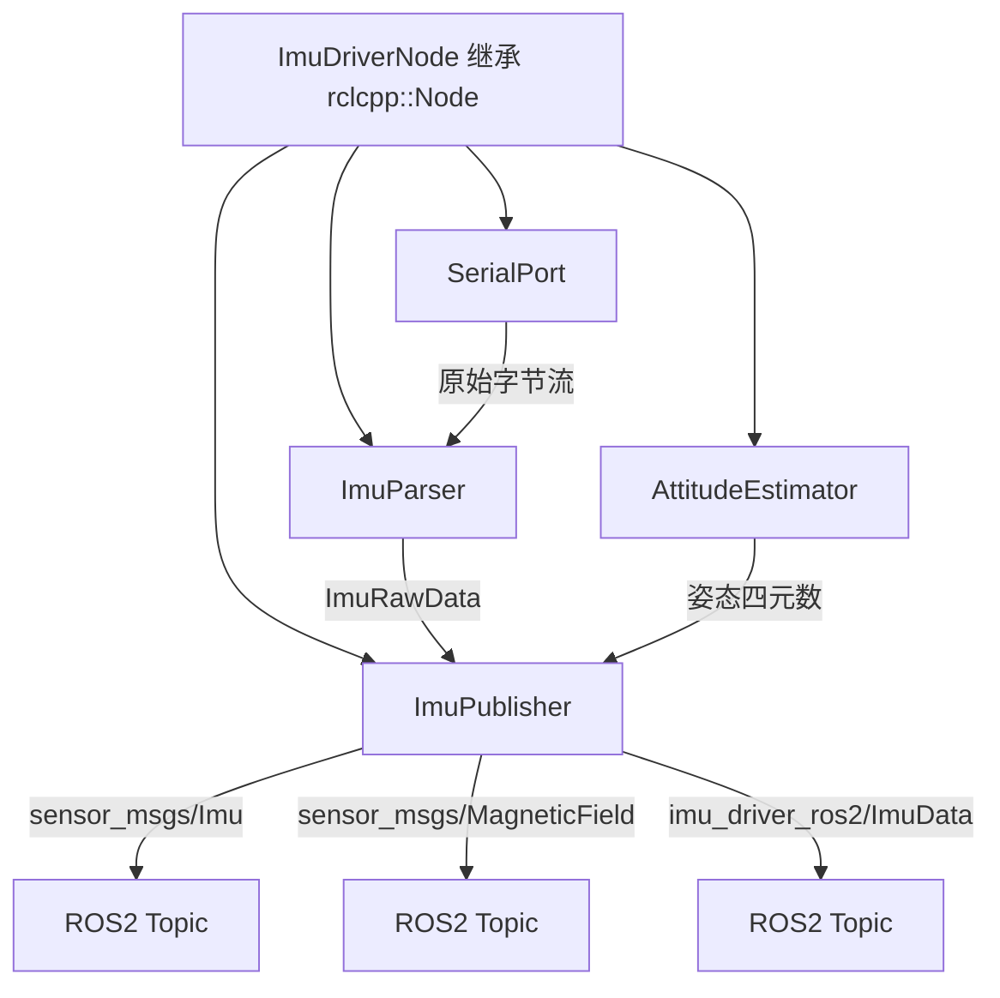

# IMU Driver ROS1 → ROS2 迁移计划

## 一、现状分析

### 当前项目结构
```
imu_driver_ros2/
├── CMakeLists.txt          # 不完整：仅编译 imu_ros_publisher.cpp，缺少其他源文件
├── package.xml             # 不完整：缺少 Eigen/Boost 依赖
├── include/
│   ├── imu_driver_node.h   # ❌ 使用 ros::NodeHandle
│   ├── imu_parser.h        # ✅ 纯 C++，无 ROS 依赖
│   ├── imu_publisher.h     # ❌ 使用 ros::Publisher, ros::Time, imu_driver_ros::ImuData
│   ├── serial_port.h       # ⚠️ 使用 boost::asio，日志依赖 ROS
│   └── algorithm/
│       ├── attitude_estimator.h   # ✅ 纯 C++/Eigen
│       ├── complementary_filter.h # ✅ 纯 C++/Eigen
│       ├── quaternion.h           # ✅ 纯 C++/Eigen
│       └── rk4_integration.h      # ✅ 纯 C++/Eigen
├── src/
│   ├── imu_driver_node.cpp   # ❌ ROS1 API（ros::NodeHandle, ROS_INFO, ros::Time, ros::ok, ros::spinOnce）
│   ├── imu_parser.cpp        # ✅ 纯 C++
│   ├── imu_publisher.cpp     # ❌ ROS1 API（ros::Publisher::publish, ros::Time, geometry_msgs）
│   ├── imu_ros_publisher.cpp # ❌ ROS1 API（ros::init, ros::NodeHandle）
│   ├── serial_port.cpp       # ⚠️ 使用 ROS_INFO/ROS_ERROR/ROS_WARN 宏
│   └── algorithm/
│       ├── attitude_estimator.cpp   # ✅ 纯 C++
│       ├── complementary_filter.cpp # ✅ 纯 C++
│       └── rk4_integration.cpp      # ✅ 纯 C++
└── launch/
    └── imu_ros_publisher.launch # ❌ ROS1 XML launch 格式
```

### ROS1 残留问题汇总

| 文件 | ROS1 API | 需要替换为 |
|------|----------|-----------|
| `imu_driver_node.h` | `ros::NodeHandle`, `ros::Time` | `rclcpp::Node` 继承, `rclcpp::Time` |
| `imu_publisher.h` | `ros::Publisher`, `ros::Time`, `imu_driver_ros::ImuData` | `rclcpp::Publisher`, `rclcpp::Time`, `imu_driver_ros2::msg::ImuData` |
| `imu_driver_node.cpp` | `ros::NodeHandle::param()`, `ROS_INFO/ERROR`, `ros::ok()`, `ros::spinOnce()`, `ros::Time::now()` | `declare_parameter()`, `RCLCPP_INFO/ERROR`, `rclcpp::ok()`, `rclcpp::spin_some()`, `node->now()` |
| `imu_publisher.cpp` | `nh.advertise<>()`, `pub.publish()`, `ros::Time` | `create_publisher<>()`, `pub->publish()`, `rclcpp::Time` |
| `imu_ros_publisher.cpp` | `ros::init()`, `ros::NodeHandle`, `ros::spinOnce()` | `rclcpp::init()`, `rclcpp::Node`, `rclcpp::spin()` |
| `serial_port.cpp` | `ROS_INFO/ERROR/WARN` | `RCLCPP_INFO/ERROR/WARN`（需传入 logger） |
| `imu_ros_publisher.launch` | ROS1 XML launch | ROS2 Python launch |

### 自定义消息问题
- 原代码引用 `imu_driver_ros/ImuData`（ROS1 包名），但项目中无 `.msg` 文件
- ROS2 需要单独的接口包或内联 msg 生成

---

## 二、架构设计

### ROS2 节点架构



### 关键设计决策

1. **节点模式**：`ImuDriverNode` 继承 `rclcpp::Node`，不再使用独立 NodeHandle
2. **主循环**：使用 `rclcpp::Rate` + `rclcpp::spin_some()` 替代 `ros::ok()` + `ros::spinOnce()`
3. **参数**：使用 `declare_parameter()` + `get_parameter()` 替代 `nh.param()`
4. **日志**：使用 `RCLCPP_INFO/get_logger()` 替代 `ROS_INFO`
5. **SerialPort 日志**：传入 `rclcpp::Logger` 引用，避免全局依赖
6. **自定义消息**：在包内 `msg/ImuData.msg` 生成，使用 `rosidl_generate_interfaces`
7. **Launch**：Python launch 文件替代 XML launch

---

## 三、详细修改计划

### 步骤 1：创建 `msg/ImuData.msg` 自定义消息

从 `imu_publisher.cpp` 中提取自定义消息字段：

```msg
std_msgs/Header header
geometry_msgs/Quaternion orientation
geometry_msgs/Vector3 linear_acceleration
geometry_msgs/Vector3 angular_velocity
geometry_msgs/Vector3 magnetic_field
bool valid
```

### 步骤 2：重写 `include/imu_driver_node.h`

**变更要点：**
- 类继承 `rclcpp::Node` 而非持有 `ros::NodeHandle`
- 移除 `ros::NodeHandle nh_` 成员
- `ros::Time` → `rclcpp::Time`
- 添加 `rclcpp::Logger` 用于日志
- 构造函数改为无参（参数通过 ROS2 声明机制获取）

```cpp
class ImuDriverNode : public rclcpp::Node {
public:
    ImuDriverNode();
    bool Init();
    void Run();
    void Shutdown();
private:
    void loadParams();
    void publishDiagnostics();
    // ... 其他成员保持不变，类型替换
    rclcpp::Time last_diag_time_;  // 替代 ros::Time
};
```

### 步骤 3：重写 `include/imu_publisher.h`

**变更要点：**
- `ros::Publisher` → `rclcpp::Publisher<>::SharedPtr`
- `ros::NodeHandle&` → `rclcpp::Node*`（用于创建 publisher）
- `ros::Time` → `rclcpp::Time`
- `imu_driver_ros::ImuData` → `imu_driver_ros2::msg::ImuData`
- `geometry_msgs::Vector3/Quaternion` → `geometry_msgs::msg::Vector3/Quaternion`
- `sensor_msgs::Imu/MagneticField` → `sensor_msgs::msg::Imu/MagneticField`

```cpp
class ImuPublisher {
public:
    ImuPublisher(rclcpp::Node* node, bool publish_custom, bool publish_sensor_msgs,
                 const std::string& frame_id,
                 std::shared_ptr<imu_algorithm::AttitudeEstimator> estimator);
    void Publish(const ImuRawData& raw, const rclcpp::Time& stamp);
private:
    // Publisher 替换
    rclcpp::Publisher<imu_driver_ros2::msg::ImuData>::SharedPtr pub_custom_;
    rclcpp::Publisher<sensor_msgs::msg::Imu>::SharedPtr pub_imu_;
    rclcpp::Publisher<sensor_msgs::msg::MagneticField>::SharedPtr pub_mag_;
    // ...
};
```

### 步骤 4：修改 `include/serial_port.h`

**变更要点：**
- 添加 `rclcpp::Logger` 成员，构造函数接收 logger
- 移除对 ROS 宏的隐式依赖

```cpp
class SerialPort {
public:
    SerialPort(const std::string& port, int baud, int timeout_ms = 100,
               const rclcpp::Logger& logger = rclcpp::get_logger("serial_port"));
    // ... 其余接口不变
private:
    rclcpp::Logger logger_;
    // ...
};
```

### 步骤 5：重写 `src/imu_driver_node.cpp`

**变更要点：**

| ROS1 | ROS2 |
|------|------|
| `ros::NodeHandle nh("~")` | 继承 `rclcpp::Node`，构造函数中声明参数 |
| `nh.param<std::string>("port", port_, ...)` | `declare_parameter("port", ...)` + `get_parameter("port", port_)` |
| `ROS_INFO(...)` | `RCLCPP_INFO(this->get_logger(), ...)` |
| `ros::Time::now()` | `this->now()` |
| `ros::ok()` | `rclcpp::ok()` |
| `ros::spinOnce()` | `rclcpp::spin_some(shared_from_this())` |
| `while(ros::ok())` | `while(rclcpp::ok())` |

### 步骤 6：重写 `src/imu_publisher.cpp`

**变更要点：**

| ROS1 | ROS2 |
|------|------|
| `nh.advertise<MsgType>(topic, queue)` | `node->create_publisher<MsgType>(topic, queue)` |
| `pub.publish(msg)` | `pub->publish(msg)` |
| `ros::Time` | `rclcpp::Time` |
| `imu_driver_ros::ImuData` | `imu_driver_ros2::msg::ImuData` |
| `geometry_msgs::Vector3` | `geometry_msgs::msg::Vector3` |
| `sensor_msgs::Imu` | `sensor_msgs::msg::Imu` |
| `(stamp - last_stamp_).toSec()` | `(stamp - last_stamp_).seconds()` |

### 步骤 7：修改 `src/serial_port.cpp`

**变更要点：**
- `ROS_INFO(...)` → `RCLCPP_INFO(logger_, ...)`
- `ROS_ERROR(...)` → `RCLCPP_ERROR(logger_, ...)`
- `ROS_WARN_THROTTLE(60, ...)` → `RCLCPP_WARN_THROTTLE(logger_, this->get_clock()->now(), 60000, ...)`

### 步骤 8：重写 `src/imu_ros_publisher.cpp`

```cpp
#include "imu_driver_node.h"
#include <rclcpp/rclcpp.hpp>

int main(int argc, char** argv) {
    rclcpp::init(argc, argv);
    auto node = std::make_shared<ImuDriverNode>();
    if (!node->Init()) {
        RCLCPP_ERROR(node->get_logger(), "Failed to initialize IMU driver node");
        rclcpp::shutdown();
        return 1;
    }
    RCLCPP_INFO(node->get_logger(), "IMU driver node started");
    node->Run();
    node->Shutdown();
    rclcpp::shutdown();
    return 0;
}
```

### 步骤 9：完善 `CMakeLists.txt`

```cmake
cmake_minimum_required(VERSION 3.8)
project(imu_driver_ros2)

# C++17 推荐（ROS2 Humble+）
if(NOT CMAKE_CXX_STANDARD)
  set(CMAKE_CXX_STANDARD 17)
endif()

if(CMAKE_COMPILER_IS_GNUCXX OR CMAKE_CXX_COMPILER_ID MATCHES "Clang")
  add_compile_options(-Wall -Wextra -Wpedantic)
endif()

# ===== 依赖 =====
find_package(ament_cmake REQUIRED)
find_package(rclcpp REQUIRED)
find_package(std_msgs REQUIRED)
find_package(sensor_msgs REQUIRED)
find_package(geometry_msgs REQUIRED)
find_package(Eigen3 REQUIRED)
find_package(Boost REQUIRED COMPONENTS system)
find_package(rosidl_default_generators REQUIRED)

# ===== 自定义消息生成 =====
rosidl_generate_interfaces(${PROJECT_NAME}
  "msg/ImuData.msg"
  DEPENDENCIES std_msgs sensor_msgs geometry_msgs
)

# ===== 包含目录 =====
include_directories(include)
include_directories(${EIGEN3_INCLUDE_DIR})

# ===== 库：算法模块 =====
add_library(imu_algorithm STATIC
  src/algorithm/attitude_estimator.cpp
  src/algorithm/complementary_filter.cpp
  src/algorithm/rk4_integration.cpp
)
target_include_directories(imu_algorithm PUBLIC include ${EIGEN3_INCLUDE_DIR})
target_link_libraries(imu_algorithm Eigen3::Eigen)

# ===== 库：核心模块 =====
add_library(imu_driver_core STATIC
  src/imu_driver_node.cpp
  src/imu_parser.cpp
  src/imu_publisher.cpp
  src/serial_port.cpp
)
target_include_directories(imu_driver_core PUBLIC include ${EIGEN3_INCLUDE_DIR})
ament_target_dependencies(imu_driver_core rclcpp std_msgs sensor_msgs geometry_msgs)
target_link_libraries(imu_driver_core imu_algorithm ${Boost_LIBRARIES})
# 需要等 msg 生成完成后才能编译
rosidl_get_typesupport_targets(cpp_typesupport_target ${PROJECT_NAME} rosidl_typesupport_cpp)
target_link_libraries(imu_driver_core "${cpp_typesupport_target}")

# ===== 可执行文件 =====
add_executable(imu_ros_publisher src/imu_ros_publisher.cpp)
target_link_libraries(imu_driver_core imu_algorithm ${Boost_LIBRARIES})
target_link_libraries(imu_ros_publisher imu_driver_core)
ament_target_dependencies(imu_ros_publisher rclcpp std_msgs sensor_msgs geometry_msgs)

# ===== Install =====
install(TARGETS imu_ros_publisher
  DESTINATION lib/${PROJECT_NAME}
)
install(DIRECTORY include/
  DESTINATION include
)
install(DIRECTORY launch/
  DESTINATION share/${PROJECT_NAME}/launch
)
install(DIRECTORY config/
  DESTINATION share/${PROJECT_NAME}/config
)

if(BUILD_TESTING)
  find_package(ament_lint_auto REQUIRED)
  ament_lint_auto_find_test_dependencies()
endif()

ament_package()
```

### 步骤 10：完善 `package.xml`

添加缺失的依赖：
- `geometry_msgs`
- `Eigen3`（通过 `<build_depend>eigen</build_depend>`）
- `Boost`（system 组件）
- `rosidl_default_generators` + `rosidl_default_runtime`（msg 生成）
- `rclcpp_components`（可选）

### 步骤 11：ROS2 Python Launch 文件

创建 `launch/imu_ros_publisher.launch.py`：

```python
from launch import LaunchDescription
from launch_ros.actions import Node
from launch.actions import DeclareLaunchArgument
from launch.substitutions import LaunchConfiguration

def generate_launch_description():
    return LaunchDescription([
        DeclareLaunchArgument('port', default_value='/dev/ttyUSB0'),
        DeclareLaunchArgument('baud', default_value='115200'),
        # ... 其他参数
        Node(
            package='imu_driver_ros2',
            executable='imu_ros_publisher',
            name='imu_ros_publisher',
            output='screen',
            parameters=[{
                'port': LaunchConfiguration('port'),
                'baud': LaunchConfiguration('baud'),
                # ...
            }]
        ),
    ])
```

### 步骤 12：添加 `config/imu_params.yaml`

```yaml
imu_ros_publisher:
  ros__parameters:
    port: "/dev/ttyUSB0"
    baud: 115200
    timeout_ms: 100
    publish_custom: false
    publish_sensor_msgs: true
    frame_id: "imu_link"
    enable_attitude_estimation: true
    algorithm_type: "complementary"
    axis_mode: "9"
    alpha_acc: 0.02
    alpha_mag: 0.01
```

---

## 四、文件修改影响矩阵

| 文件 | 修改程度 | 说明 |
|------|---------|------|
| `msg/ImuData.msg` | 🆕 新建 | 自定义消息定义 |
| `include/imu_driver_node.h` | 🔴 重写 | ROS1→ROS2 核心 API 全部替换 |
| `include/imu_publisher.h` | 🔴 重写 | Publisher/Time/消息类型全部替换 |
| `include/serial_port.h` | 🟡 中等 | 添加 Logger 参数 |
| `include/imu_parser.h` | 🟢 无修改 | 纯 C++，无 ROS 依赖 |
| `include/algorithm/*` | 🟢 无修改 | 纯 C++/Eigen，无 ROS 依赖 |
| `src/imu_driver_node.cpp` | 🔴 重写 | 参数/日志/时间/循环全部替换 |
| `src/imu_publisher.cpp` | 🔴 重写 | 发布 API/消息类型/时间全部替换 |
| `src/serial_port.cpp` | 🟡 中等 | 日志宏替换 |
| `src/imu_ros_publisher.cpp` | 🔴 重写 | 入口函数 ROS2 化 |
| `src/imu_parser.cpp` | 🟢 无修改 | 纯 C++ |
| `src/algorithm/*` | 🟢 无修改 | 纯 C++/Eigen |
| `CMakeLists.txt` | 🔴 重写 | 完整构建配置 |
| `package.xml` | 🟡 中等 | 补充依赖声明 |
| `launch/imu_ros_publisher.launch.py` | 🆕 新建 | ROS2 Python launch |
| `config/imu_params.yaml` | 🆕 新建 | 默认参数文件 |
| `launch/imu_ros_publisher.launch` | 🗑️ 删除 | ROS1 XML launch 废弃 |

---

## 五、注意事项

1. **C++ 标准**：ROS2 Humble+ 推荐 C++17，Eigen3 兼容
2. **Boost.Asio**：ROS2 中仍可使用 Boost.Asio 做串口，无需替换
3. **自定义消息**：`ImuData.msg` 依赖 `std_msgs`, `geometry_msgs`，需在 `rosidl_generate_interfaces` 中声明 DEPENDENCIES
4. **线程安全**：ROS2 的 `rclcpp::spin_some()` 在主循环中调用，与 ROS1 的 `ros::spinOnce()` 类似
5. **Logger 传递**：SerialPort 不继承 Node，需通过构造函数传入 Logger
6. **时间源**：`rclcpp::Time` 使用节点时钟，与 `ros::Time` 行为一致
7. **编译顺序**：msg 生成须先于依赖它的源文件编译，CMake 中需用 `rosidl_get_typesupport_targets` 确保依赖顺序
